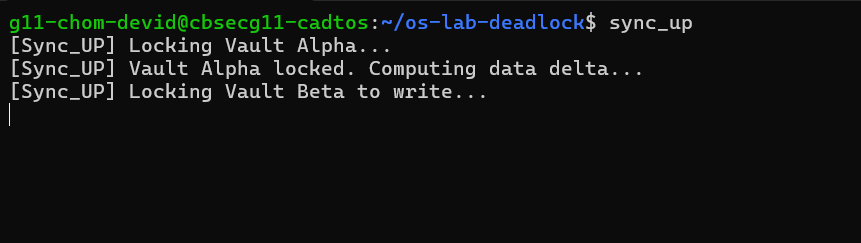
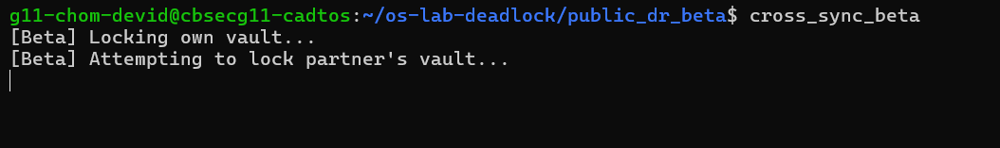
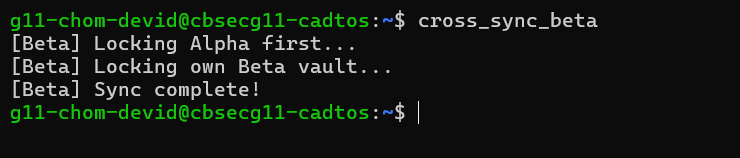
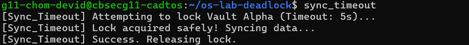
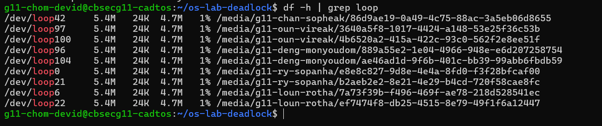

# OS Lab Quantum Widget Report
**Name:** ChomDevid
**Student ID:** IDTB110094
**Repository:** os-lab-deadlock-IDTB110094

-----------------------------------------------------

## Level 1
### Observation 
The output of df -h | grep loop shows that the virtual image files have been successfully attached as loop devices (/dev/loop30 and /dev/loop31) and mounted to the filesystem. Each device has a usable size of approximately 5.4MB, with minimal space used, confirming that the virtual drives are correctly formatted and ready for use.

## Level 3
### Observation 
The scripts freeze because they each hold one resource and wait for the other, creating a circular wait. sync_up locks Vault Alpha and waits for Vault Beta, while sync_down locks Vault Beta and waits for Vault Alpha. Since neither releases their initial lock, both processes are indefinitely blocked, demonstrating a classic OS deadlock scenario.

.png)

## Level 4
### Observation 
Both scripts freeze because each user holds their own vault lock and waits for the partner’s vault lock, creating a circular wait. This simulates a distributed deadlock where neither process can proceed until manually interrupted.

## Level 5

### Observation 
Both scripts complete sequentially without freezing because Player B waits for Alpha before locking Beta. Modifying the lock order breaks the Circular Wait, preventing the distributed deadlock.

## Level 6
### Observation 
The sync_timeout script attempts to lock Vault Alpha but aborts after 5 seconds if unavailable. This prevents freezing and allows the system to recover safely from potential deadlocks.

## Level 7
### Observation
The teardown script safely unmounts the virtual vaults, deletes loopback devices, and removes symlinks. Proper teardown prevents file system corruption and orphaned kernel resources, ensuring system stability.

